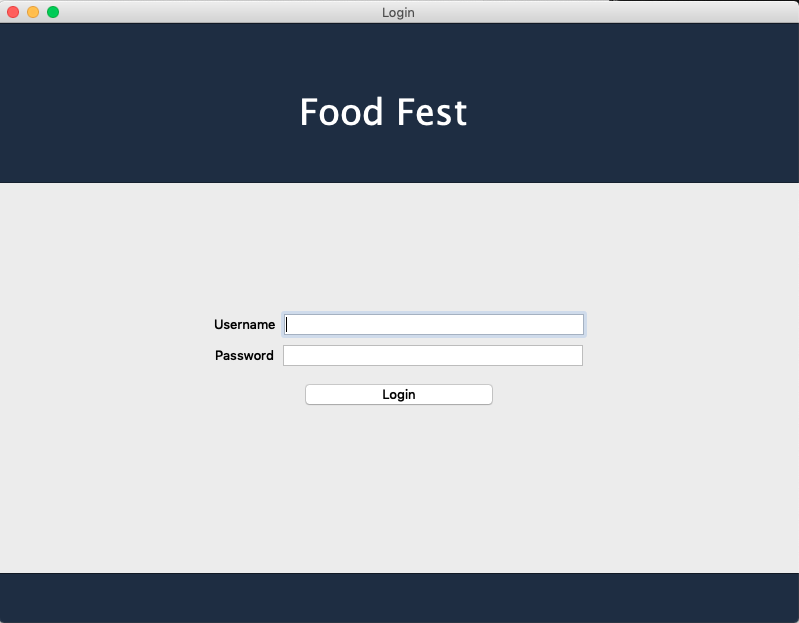
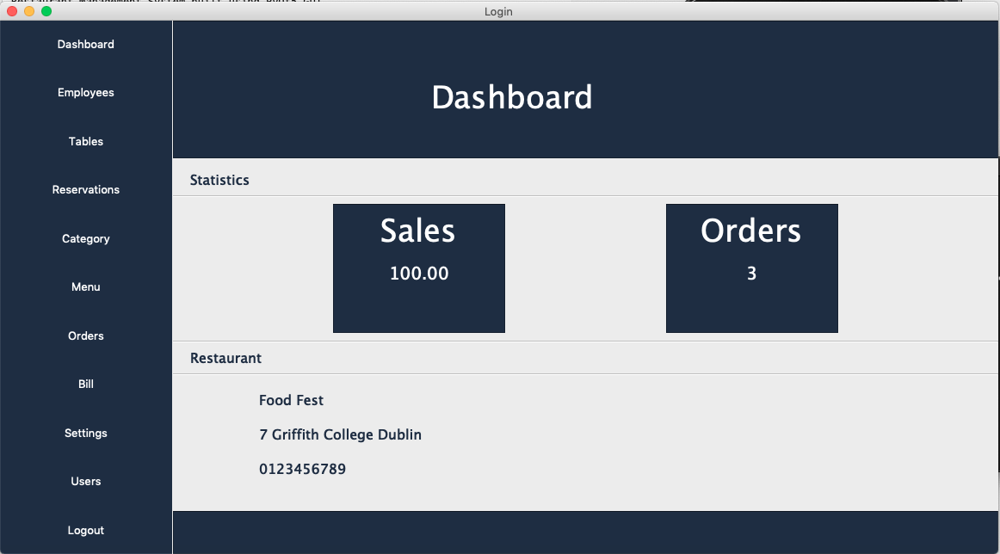
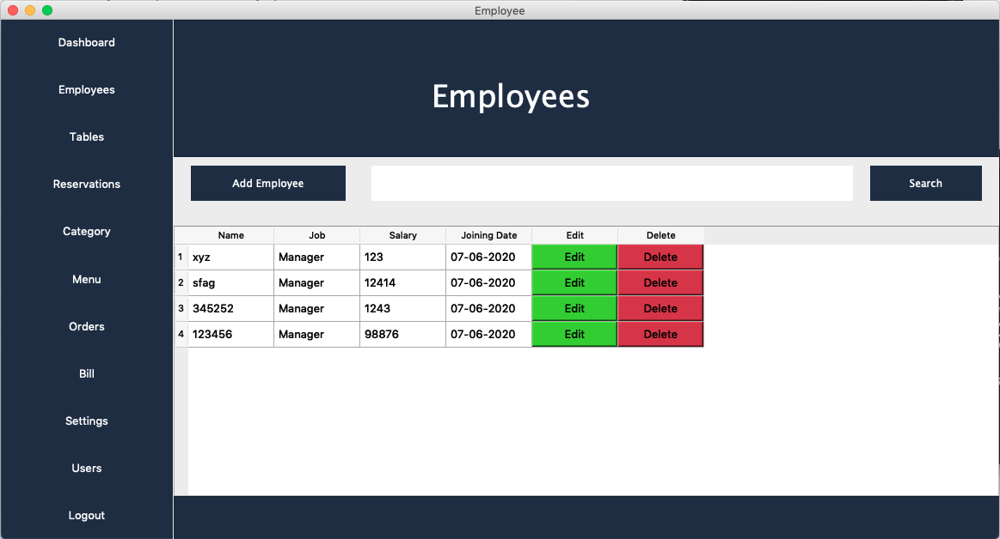
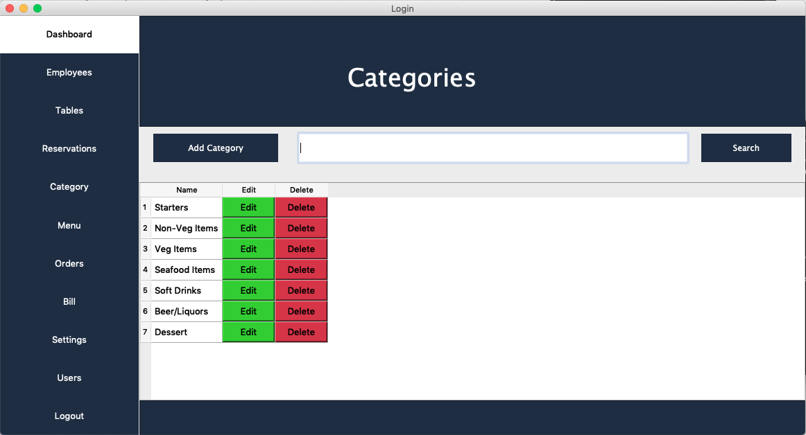
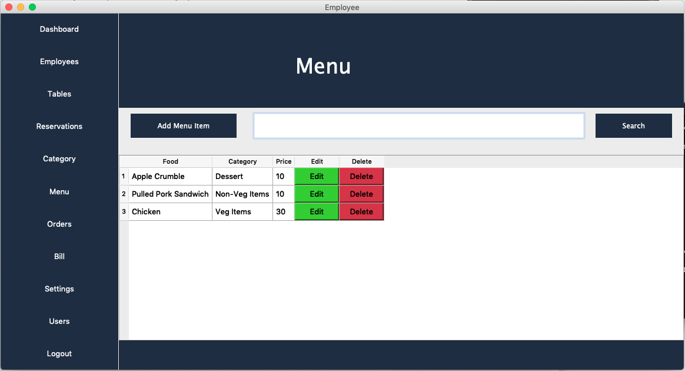
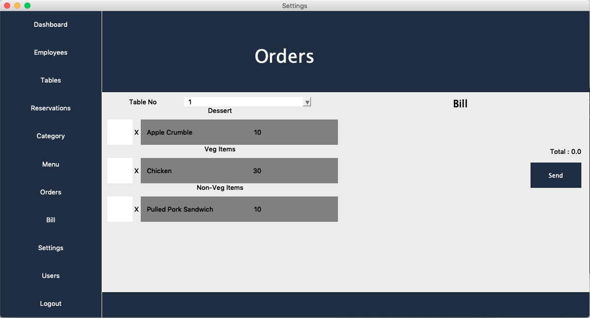
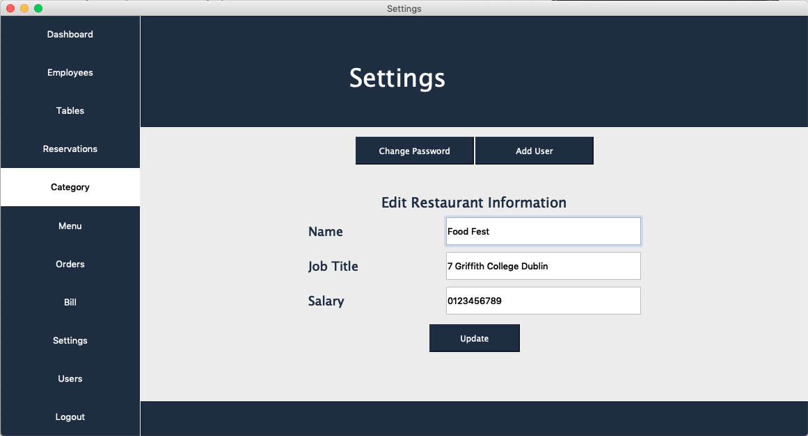

# RestaurantManagementSystem
Restaurant Management System built using PyQt5 GUI

## Application Requirement
* Make sure you have python installed in your machine.
* Install PyQt5
* Install mysql client (mysql.connector)

## Running the Application
* Clone the project
* cd rms
* type python __main__.py in terminal

### Preview
 
 
 
 
 
 
 
